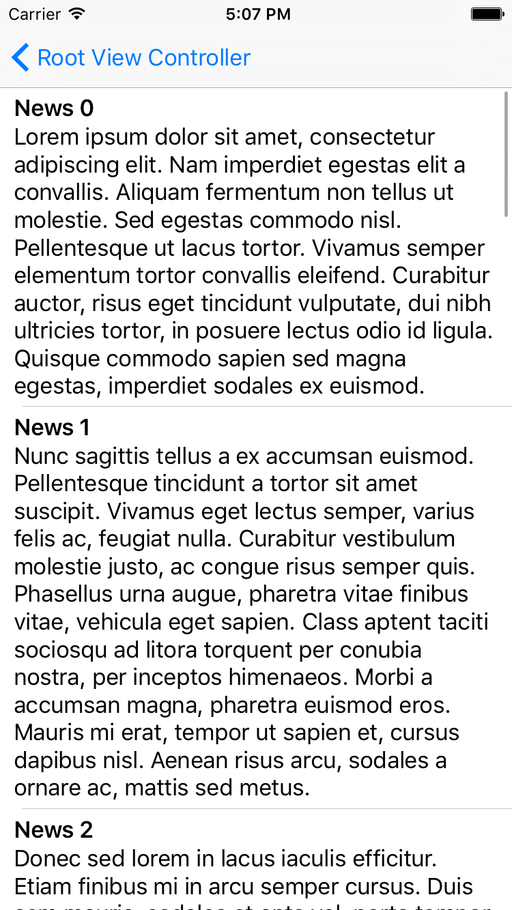
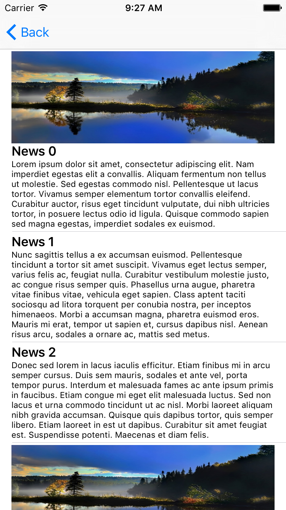

# Dynamic Height Table View Cell Example

Simple example project to create dynamic height table view cells.

* Built with Xcode 7.2.1.
* Written in Objective-C.
* Default UITableViewCell and custom table view cell.

## Screenshots

* Default UITableViewCell

* Custom UITableViewCell

* Custom UITableViewCell with image

## License
